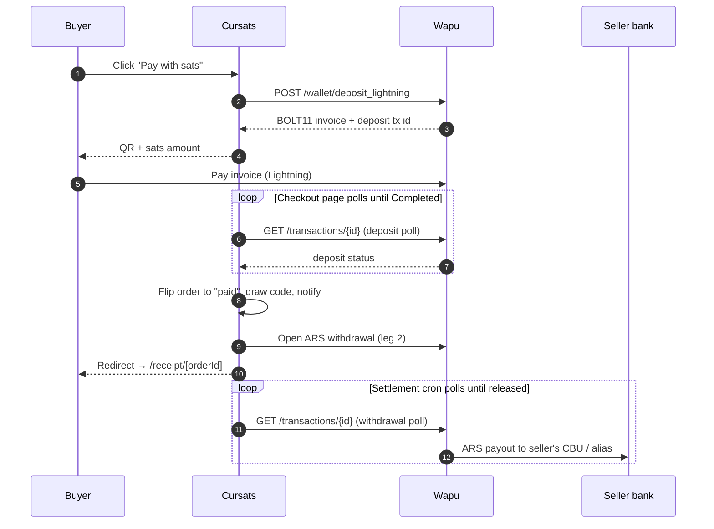
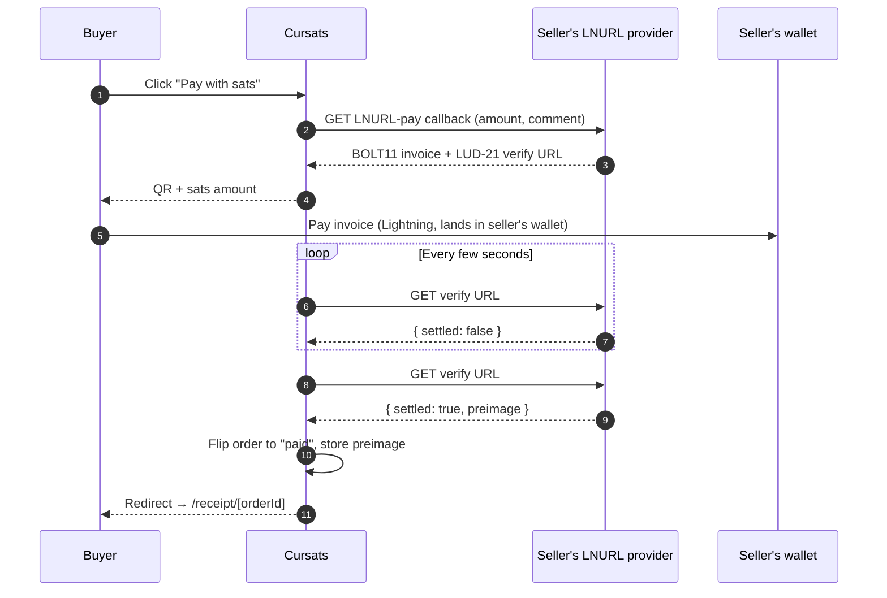

# Checkout flow

> **Status:** Active
> **Last updated:** 2026-05-24

---

## Change Log

| Date | Section | Change | Reason |
|---|---|---|---|
| 2026-05-24 | Wapu rail | Corrected the "deployment never holds the buyer's sats / same call" bullet to match the two-leg flow and the diagram: the deposit credits USDT to a Cursats-controlled Wapu wallet (leg 1) and the seller payout is a separate withdrawal (leg 2), so the rail is custodial in transit. | The bullet still described the pre-ADR-0025 direct-payment model and contradicted its own leg-1/leg-2 sequence diagram. |
| 2026-05-23 | Wapu rail, Why the rails feel identical, Polling, prose/diagrams | Rewrote the residual webhook language for the wapu_ars rail to the poll-driven model (deposit poll is the source of truth); switched Spanish UI labels in prose, code blocks, and diagrams to the English `messages/en.json` strings. | Docs must match the implemented poll-driven rail (ADR 0025) and the English-only UI judges test against. |
| 2026-05-22 | Sequence diagrams, Confirmation table, Polling, Pointers | Switched the wapu_ars flow to poll-driven (no webhook): deposit-poll sequence + confirmation source, settlement cron/sync pointers; removed the optional-Nostr-DM step. | The Wapu rebuild (ADR 0025) made the rail poll-driven and the server Nostr-DM channel was removed as dead code. |
| 2026-05-21 | — | Initial version. | Hackathon documentation pass — feature-level deep dive on the buyer flow, with sequence diagrams for both payout rails. |

---

## Table of Contents

1. [What this covers](#what-this-covers)
2. [The buyer journey at a glance](#the-buyer-journey-at-a-glance)
3. [Rail dispatch — `users.payout_method`](#rail-dispatch--userspayout_method)
4. [Wapu rail (`wapu_ars`)](#wapu-rail-wapu_ars)
5. [Lightning rail (`direct_lightning`)](#lightning-rail-direct_lightning)
6. [Why the rails feel identical to the buyer](#why-the-rails-feel-identical-to-the-buyer)
7. [Polling, timeouts, and the no-double-spend invariant](#polling-timeouts-and-the-no-double-spend-invariant)
8. [Where to look in the code](#where-to-look-in-the-code)

---

## What this covers

The buyer flow from "click Pay with sats" to "see the redemption
code" — end-to-end, both payout rails. For the seller-side configuration
that determines which rail an order takes, see
[settings-and-payouts](./settings-and-payouts.md). For the
delivery channel that follows payment, see
[delivery-and-receipts](./delivery-and-receipts.md). For the
rail-design rationale, see [settlement-rails](./settlement-rails.md).

## The buyer journey at a glance

```text
1. Open offering at /<userSlug>/c/<offeringSlug>
2. Click "Pay with sats"           → /checkout/[orderId]
3. See QR + sats amount            → pay with any Lightning wallet
4. Land on /receipt/[orderId]      → redemption code OR download link
```

The buyer never picks a rail, never sees the word "Wapu", never
sees a Lightning Address. They see sats and they pay sats. The
dispatch happens server-side on the seller's stored
`payout_method`.

## Rail dispatch — `users.payout_method`

Every offering belongs to a user, and every user has exactly one
of two values in `users.payout_method` (default `cbu_alias`):

- `cbu_alias` — sats in, ARS out to the seller's CBU/alias
- `lightning_address` — sats in, sats out to the seller's
  Lightning Address

The checkout API (`POST /api/checkout` → `createOrder` in
`lib/orders.ts`) reads the value on order creation, picks the
right invoice-creation path, and stamps `orders.rail` with the
corresponding rail value:

| `users.payout_method` | `orders.rail` | Confirmation source |
|---|---|---|
| `cbu_alias` | `wapu_ars` | Wapu deposit poll |
| `lightning_address` | `direct_lightning` | LUD-21 verify poll |

Once stamped, the rail is immutable for that order — a seller who
changes their payout method mid-flight does not retroactively
redirect open invoices.

Decisions in ADR
[0015-sats-settlement-rail](../architecture/decisions/0015-sats-settlement-rail.md).

## Wapu rail (`wapu_ars`)



Key points:

- **Wapu creates the invoice; the deposit lands in a Cursats
  wallet.** Wapu's deposit endpoint (leg 1) mints the BOLT11; when
  the buyer pays, the funds are credited as USDT to a
  **Cursats-controlled Wapu wallet**, not directly to the seller.
  The seller's ARS payout is a separate withdrawal (leg 2, below),
  so on this rail Cursats holds the funds in transit — it is
  custodial, unlike `direct_lightning`.
- **The deposit poll is the source of truth.** There is no
  webhook. The checkout page polls `GET /api/orders/[orderId]`,
  which runs `pollWapuDeposit` (`lib/wapu-settlement.ts`) against
  the Wapu deposit transaction. The order flips to `paid` only when
  Wapu reports the deposit `Completed`; a transient upstream
  failure leaves the order `pending` so the next poll retries.
- **Polling only advances `wapu_ars` orders.** `pollWapuDeposit`
  is reached only for an order whose `rail === 'wapu_ars'`; a
  `direct_lightning` order takes the LUD-21 verify path instead.
  The two rails never cross-confirm each other.
- **The seller payout is a separate, poll-driven leg.** Once the
  deposit confirms, the same request opens the ARS withdrawal
  (leg 2); the cron `/api/cron/wapu-settlements` (and the on-demand
  `/api/orders/sync`) polls that withdrawal to completion. The conversion to ARS and
  the bank push happen inside Wapu, and the seller receives pesos
  in their CBU/alias the same business day.

Wapu API contract is documented in
[`wapu-cli`](https://github.com/wapu-app/wapu-cli) until Wapu
publishes formal docs; the staging environment at
`https://staging.wapu.app` accepts fake money for testing.

## Lightning rail (`direct_lightning`)



Key points:

- **No converter in the middle.** The sats land directly in the
  seller's Lightning wallet via their LNURL provider; the
  deployment never custodies funds, not even briefly.
- **LUD-21 is mandatory on this rail.** The seller's LNURL
  provider must return a `verify` URL on its pay callback;
  without it, the platform has no server-side way to confirm
  payment. Settings rejects providers that don't advertise it
  (see [settings-and-payouts](./settings-and-payouts.md) for the
  1-sat probe that gates this).
- **Polling, not webhooks.** Lightning Address providers don't
  push events to merchants. The client poll on
  `/checkout/[orderId]` triggers the server to re-poll the
  verify URL; the server stamps `paid_at` only when verify
  returns `{ settled: true }`.
- **This rail never touches Wapu.** Confirmation is the LUD-21
  verify poll only; nothing on the Wapu side can flip a
  Lightning-rail order to paid.

## Why the rails feel identical to the buyer

Both rails share the same buyer surface:

| Step | Buyer sees |
|---|---|
| Click Pay with sats | Spinner → checkout page |
| Checkout page | QR + sats amount + countdown |
| After paying | "Waiting for your payment…" → redirect to receipt |
| Receipt page | Redemption code or download URL, plus order summary |

Differences live entirely below the UI: the invoice provider
(Wapu vs LNURL), which transaction the server polls to confirm
(the Wapu deposit vs the LUD-21 verify URL), and where the sats
end up (Wapu's converter vs the seller's wallet). The buyer does
not need to know — and is never asked.

This is intentional. The cost of teaching every buyer "this is a
Wapu invoice but the next seller you buy from will be a Lightning
Address invoice" is higher than the cost of one server-side
dispatch.

## Polling, timeouts, and the no-double-spend invariant

- **Checkout-page polling is a UX nicety, not the trigger.** The
  page polls `/api/orders/[orderId]` to know when to advance; the
  *source of truth* is either the Wapu deposit transaction (rail =
  `wapu_ars`) or the LUD-21 verify URL (rail = `direct_lightning`).
  If the
  buyer closes the tab mid-payment, the rail still confirms the
  order the next time the order is touched.
- **Invoices expire.** Lightning invoices carry a finite
  expiry — both rails honour it. An unpaid order remains
  `pending` and is harmless; the buyer can start a new order from
  the offering page.
- **The same order cannot be paid twice.** Order status is
  one-way into a terminal state (`paid`, `failed`, or `refunded` —
  there is no `expired` status). Once `paid`, `markOrderPaid`
  short-circuits on both rails (the Wapu deposit poller and the
  LUD-21 verify poller); no second payment can flip state again,
  and no second redemption code is drawn from the pool.
- **Receipt URLs are opaque.** The `orderId` in the URL is a
  ≥128-bit unguessable identifier (see
  [delivery-and-receipts](./delivery-and-receipts.md)). Knowing
  one buyer's receipt URL does not let you enumerate others.

## Where to look in the code

| What | Where |
|---|---|
| Order creation | `app/api/checkout/route.ts` → `createOrder` in `lib/orders.ts` |
| Order status poll (Wapu deposit + LUD-21 verify) | `app/api/orders/[orderId]/route.ts` |
| Settlement orchestration (poll deposit, open + poll withdrawal) | `lib/wapu-settlement.ts` |
| Settlement cron + seller sync | `app/api/cron/wapu-settlements/route.ts`, `app/api/orders/sync/route.ts` |
| Wapu API client | `lib/wapu.ts` |
| Lightning invoice mint + LUD-21 verify | `lib/lightning.ts` (LNURL helper in `lib/nostr/lnurl.ts`) |
| Rail dispatch + state machine | `lib/orders.ts` (reads `users.payout_method`, stamps `orders.rail`) |
| Code draw on payment | `lib/orders.ts:drawAndAssignCode` |
| Exchange rate (display only) | `lib/exchange-rate.ts:getSatsPerArs()` |

For the higher-level architecture, see
[architecture/overview.md](../architecture/overview.md) and the
ADRs it cross-references.
